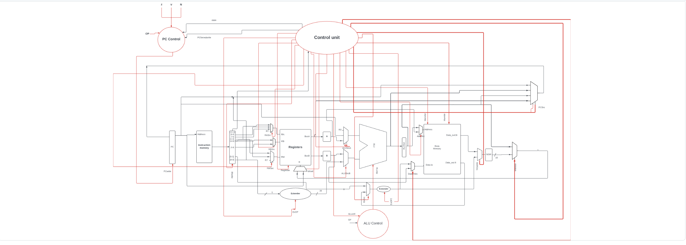

**Multi-Cycle RISC Processor**

**Overview**

 * This project involves the design and verification of a multi-cycle RISC processor implemented in Verilog.
 * The processor operates on 16-bit instructions and supports four instruction types: R-type, I-type, J-type, and S-type.
 * The design includes eight 16-bit general-purpose registers, a 16-bit program counter, and separate instruction and data memories.
 * The processor is capable of executing a variety of operations, from basic arithmetic to complex memory access and branching.

**Processor Specifications**

 * Instruction Size: 16 bits
 * Registers: 8 general-purpose 16-bit registers (R0-R7)
   
            Note: R0 is hardwired to zero and cannot be modified.
 * Special Purpose Register: 16-bit Program Counter (PC)
 * Instruction Types:

        R-type: Register-based operations
   
        I-type: Immediate operations

        J-type: Jump operations

        S-type: Store operations

 * Memory Architecture:
        
           Separate data and instruction memories
           
           Byte addressable
           
           Little-endian byte ordering

**Features**

* Datapath Components: Includes instruction memory, data memory, register file, ALU, and extenders.
* Control Units:

          Main control unit with a state machine to manage instruction execution.
  
          PC control unit to handle program counter updates based on branching conditions.
  
          ALU control unit to manage arithmetic and logic operations.
  
* Simulation and Testing: Comprehensive testing with multiple test cases to ensure correct operation of the processor across various instruction types.

  
        
**Project Deliverables**

* Verilog Source Code: Implementation of the processor components and control units.
* Test Benches: Verification of the processor’s functionality through various test scenarios.
* Project Report: Detailed documentation explaining the design and implementation, including block diagrams, truth tables, and testing results.

**Project Documentation**

You can view the detailed project report [here](Report.pdf).

**How to Run**

1. Clone the repository.
2. Open the project in a Verilog-compatible simulator.
3. Load the provided test benches to simulate and verify the processor’s functionality.
4. Review the waveform outputs to confirm the correct operation of the processor.

**Authors**

* Kareem Qutob
* Ahmad Qaimari
* Husain Abugosh

**License**
This project is licensed under the MIT License - see the LICENSE file for details.

**Acknowledgments**

Special thanks to the Electrical and Computer Engineering Department for the guidance and resources provided during this project.

        

   
 
        

   

